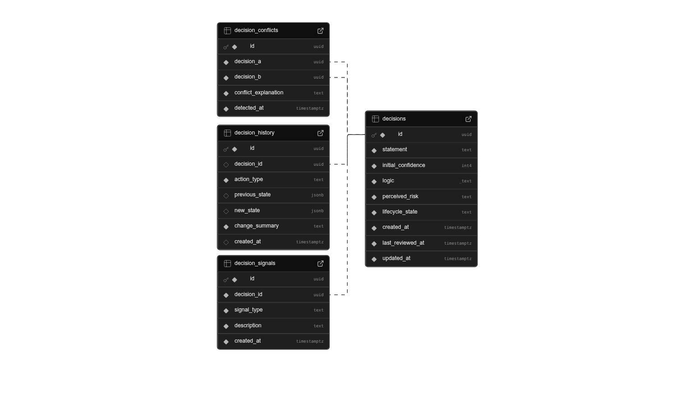
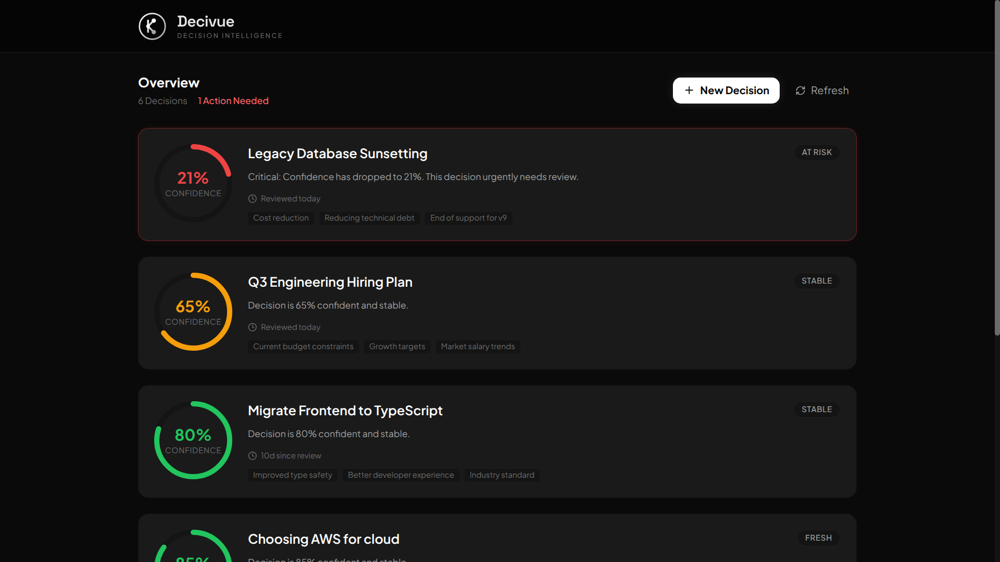
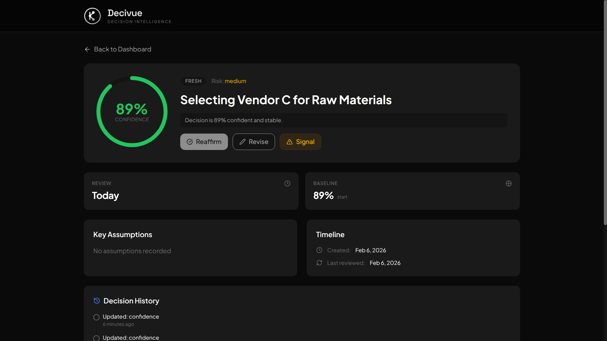

# Decivue

A decision intelligence system that helps teams track the health and reliability of their decisions over time.

[](https://nextjs.org/)
[](https://www.typescriptlang.org/)
[](https://supabase.com/)
[](https://tailwindcss.com/)
[](https://opensource.org/licenses/MIT)

## The Problem

Organizations make critical decisions daily—choosing vendors, approving plans, prioritizing options. These decisions are made with incomplete information and temporary assumptions. Over time, conditions change, assumptions break, and the original reasoning fades. Yet the decision continues to influence actions.

Most tools focus on tasks and execution. Decivue focuses on the decisions themselves.

## What It Does

Decivue treats decisions as living entities, not static records. Each decision has:

- A clear statement of the choice made
- Initial confidence level (0-100%)
- Key assumptions/logic behind it
- Perceived risk level (low/medium/high/critical)

The system tracks how decision reliability evolves through:

**Confidence Decay** — Decisions naturally lose reliability over time. Higher risk decisions decay faster:
- Low risk: 0.5% per day
- Medium: 1% per day  
- High: 2% per day
- Critical: 3% per day

**Lifecycle States** — Decisions move through states based on confidence and time since last review:
- Fresh → Stable → At Risk → Stale → Invalidated

**Signals** — Users can report external changes that affect a decision (market shifts, team changes, budget constraints, etc.)

**Conflict Detection** — When creating a new decision, the AI checks for conflicts with existing decisions and explains them in plain language.

**History Timeline** — Complete audit trail of reaffirmations, edits, and dismissed signals.

## Tech Stack

- Next.js 16 (App Router)
- TypeScript
- Supabase (PostgreSQL)
- Tailwind CSS
- Google Gemini AI (for conflict detection)

## Setup

### 1. Install dependencies

```bash
pnpm install
```

### 2. Environment variables

Create `.env.local`:

```
NEXT_PUBLIC_SUPABASE_URL=your_supabase_url
NEXT_PUBLIC_SUPABASE_ANON_KEY=your_supabase_anon_key
GEMINI_API_KEY=your_gemini_key
```

### 3. Database

Schema overview:



Run [`docs/schema.sql`](docs/schema.sql) in Supabase SQL Editor to create the tables.

### 4. Run

```bash
pnpm dev
```

Open http://localhost:3000

## Project Structure

```
src/
├── app/
│   ├── page.tsx                    # Dashboard
│   ├── decision/[id]/page.tsx      # Decision detail
│   └── api/detect-conflicts/       # Gemini AI endpoint
├── components/
│   ├── ConfidenceGauge.tsx
│   ├── HistoryTimeline.tsx
│   └── decision/                   # Detail page components
├── hooks/
│   └── useDecision.ts
├── lib/
│   ├── decision-intelligence.ts    # Core algorithms
│   └── supabase/
└── types/
    └── decision.ts
```

## How It Works

The core logic lives in `decision-intelligence.ts`:

```typescript
// Confidence decays based on risk level
currentConfidence = initialConfidence - (daysSinceReview * decayRate)

// State transitions based on confidence + time
if (confidence < 15) return 'invalidated'
if (days <= 7 && confidence >= 70) return 'fresh'
if (days <= 14 && confidence >= 50) return 'stable'
if (confidence >= 15 && days <= 60) return 'at_risk'
return 'stale'
```

Users can **Reaffirm** a decision to reset the decay timer, **Revise** to update the decision, or **Add Signals** to flag external changes.

## Notes

- **No authentication** — The problem statement explicitly states enterprise-grade authentication is not required, so we focused on core decision intelligence features instead.
- **Minimal UI** — The target users are non-technical teams (managers, leads, planners). The interface is intentionally clean and jargon-free so anyone can understand decision health at a glance.
- **Fully responsive** — Works on desktop, tablet, and mobile. Decision-makers can check on their decisions from anywhere.

## Screenshots

| Dashboard | Decision Detail |
|-----------|-----------------|
|  |  |


---

Built for Alphabyte 3.0 Hackathon | Problem Statement 6
